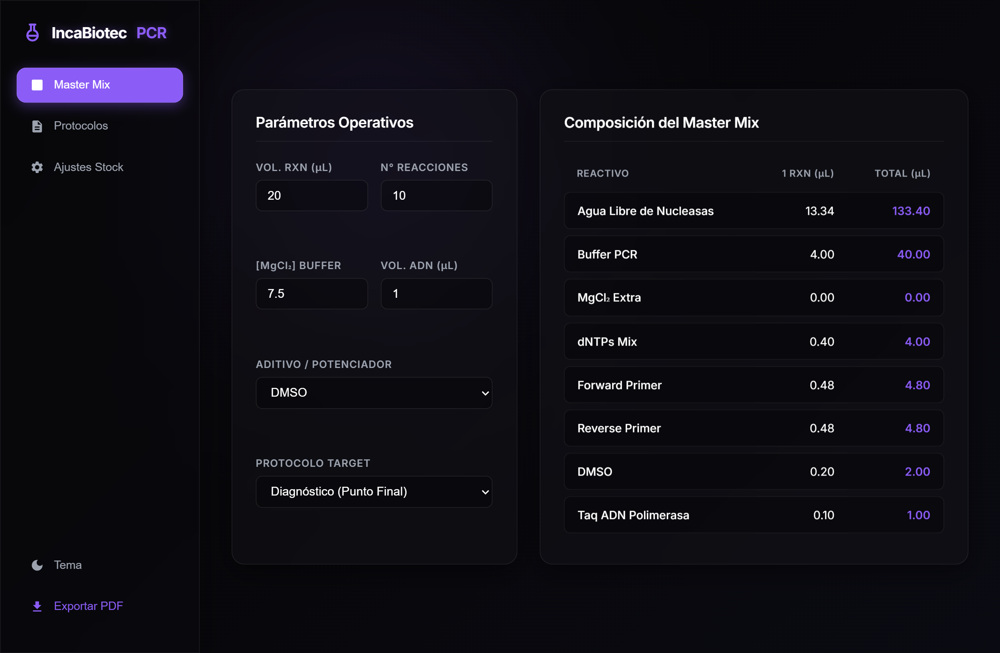

# IncaBiotec PCR Calculator: Master Mix Optimization Platform 🧬

## 🚀 Live Demo
**Try the application directly in your browser:** 👉 [**Access the IncaBiotec PCR Calculator**](https://mrodrigueze.github.io/incabiotec-pcr-calculator/) 👈

## 📌 Overview
The **IncaBiotec PCR Calculator** is a precision tool designed to automate the preparation of PCR Master Mixes. In molecular diagnostics, manual volume calculations—specifically ionic compensation—are a frequent source of pipetting errors. This platform standardizes the process, ensuring reproducibility across experiments.

  

## 🧪 Core Functionality: Master Mix Automation
Unlike basic calculators, this system focuses on the **chemical stoichiometry** of the reaction:

* **Dynamic Dilution Engine:** Implements the $C_1V_1 = C_2V_2$ principle for all reagents (Primers, dNTPs, Enzyme).
* **MgCl₂ Ionic Compensation:** Automatically subtracts the $MgCl_2$ concentration provided by the buffer to reach the exact target molarity.
* **Additive Integration:** Supports modular calculation for enhancers like **BSA** and **DMSO** without breaking the final volume balance.
* **Contextual Presets:** Includes reference thermocycler programs for high-impact diagnostics (AHPND, WSSV, ITS).

## 📊 Technical Features
* **One-Click PDF Reporting:** Generates a report for lab notebooks.
* **Persistent Configuration:** Saves reagent stock data in `localStorage` for fast-access workflows.

## 🧮 Mathematical Foundation

The platform computes the volume of each component ($V_i$) based on the total reaction volume ($V_t$):

$$V_i = \frac{C_{\text{target}} \times V_t}{C_{\text{stock}}}$$

For $MgCl_2$ compensation:

$$V_{\text{MgCl}_2 \text{ extra}} = \frac{(C_{\text{target}} - C_{\text{from buffer}}) \times V_t}{C_{\text{stock MgCl}_2}}$$

## 🛠️ Stack
- **Engine:** Vanilla JavaScript (ES6+)
- **Interface:** CSS3 Glassmorphism & Flexbox Grid
- **Export:** html2pdf.js

---

## 👨‍🔬 Author: 
**Manuel Isaias Rodriguez Espejo** Biotechnologist | Molecular Process Optimizer & Software Developer

[GitHub](https://github.com/mrodrigueze) · [LinkedIn](https://www.linkedin.com/in/mrodrigueze)

---

## 📄 License

[MIT License](https://opensource.org/licenses/MIT)
